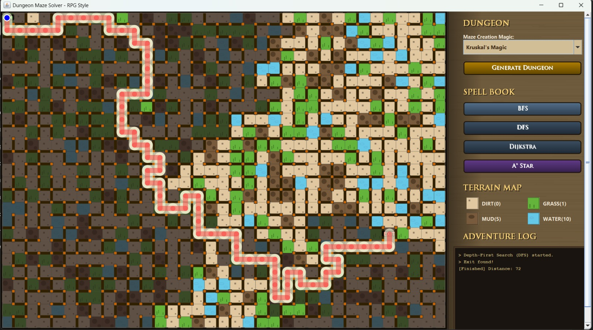

# 🏰 Dungeon Maze Generator & Solver - RPG Style


A generic visualization tool for Maze Generation and Pathfinding algorithms, wrapped in a dark **Dungeon RPG theme**. Watch how the dungeon is built brick-by-brick and how different adventurers (algorithms) navigate through treacherous terrains like Mud and Water.

---

## ✨ Key Features

* **🎮 RPG Themed UI**: Custom "WoodPanel" interface, medieval fonts, and an "Adventure Log" that narrates the process.
* **🎥 Animated Visualization**: Watch the maze being generated and solved in real-time.
* **🌍 Weighted Terrain System**: The floor isn't just empty space!
    * **Dirt**: Normal speed (Cost: 0)
    * **Grass**: Slight resistance (Cost: 1)
    * **Mud**: Slow movement (Cost: 5)
    * **Water**: Very slow movement (Cost: 10)
* **🧠 Multiple Algorithms**: Includes both maze generation and pathfinding solvers.

---

## 🧙‍♂️ Algorithms Included

### 🏗️ Maze Generators (Dungeon Creation)
1.  **Randomized Prim's Algorithm**: Grows the maze from a single point, creating a natural spreading pattern.
2.  **Randomized Kruskal's Algorithm**: Connects disjoint sets (islands) of rooms randomly until one massive dungeon is formed.

### 🧭 Pathfinding Solvers (Spell Book)
1.  **Breadth-First Search (BFS)**: Explores all directions equally. Guarantees the shortest path in unweighted graphs.
2.  **Depth-First Search (DFS)**: Ventures deep into one path until it hits a wall, then backtracks. Produces organic, winding paths.
3.  **Dijkstra's Algorithm**: The smartest choice for weighted terrain. It finds the path with the **lowest movement cost**, avoiding mud and water if possible.
4.  **A* (A-Star) Search**: Uses heuristics (Manhattan Distance) to guess the direction of the exit, finding the optimal path much faster than Dijkstra.

---

## 📸 Screenshots

*(Place your screenshots here. Example:)*
> 

---

## 🚀 How to Run

### Prerequisites
* **Java Development Kit (JDK)** version 8 or higher (Project uses JDK 23 settings).
* Any Java IDE (IntelliJ IDEA, Eclipse, NetBeans) or Terminal.

### Installation Steps

1.  **Clone the Repository**
    ```bash
    git clone [https://github.com/username/MazePuzzle-rafsyah.git](https://github.com/username/MazePuzzle-rafsyah.git)
    cd MazePuzzle-rafsyah
    ```

2.  **Compile the Code**
    Navigate to the `src` folder:
    ```bash
    cd src
    javac Main.java
    ```

3.  **Run the Game**
    ```bash
    java Main
    ```

---

## 🕹️ Controls

1.  **Choose Generation Magic**: Select "Prim's Magic" or "Kruskal's Magic" from the dropdown.
2.  **Generate Dungeon**: Click the button to watch the walls being built.
3.  **Cast a Spell (Solve)**: Click one of the solver buttons (BFS, DFS, Dijkstra, A*).
4.  **Watch the Log**: The sidebar will update with the status of the "scouting party" and the total distance traveled.

---

## 📂 Project Structure

* `src/Main.java`: Entry point of the application.
* `src/MazeGame.java`: Main JFrame window, UI layout, and sidebar controls.
* `src/MazePanel.java`: The core logic. Handles grid rendering, animations, and algorithm implementations.
* `src/Cell.java`: Represents a single block in the grid (coordinates, walls, visited status).
* `src/Terrain.java`: Enum defining terrain types and their movement costs.
* `src/Node.java`: Helper class for A* and Dijkstra to handle costs (gCost, hCost, fCost).
* `src/Wall.java`: Helper object representing a wall between two cells.

---

## 🛠️ Technologies Used

* **Language**: Java
* **GUI Library**: Swing (JPanel, Graphics2D)
* **Concepts**: Graph Theory, Minimum Spanning Tree (MST), Pathfinding, Object-Oriented Programming.

---

## 👤 Author

**Rafsyah**
* Maze Generation Logic
* Pathfinding Implementation
* UI/UX Design

---

*Enjoy the dungeon exploration! 🗝️*
